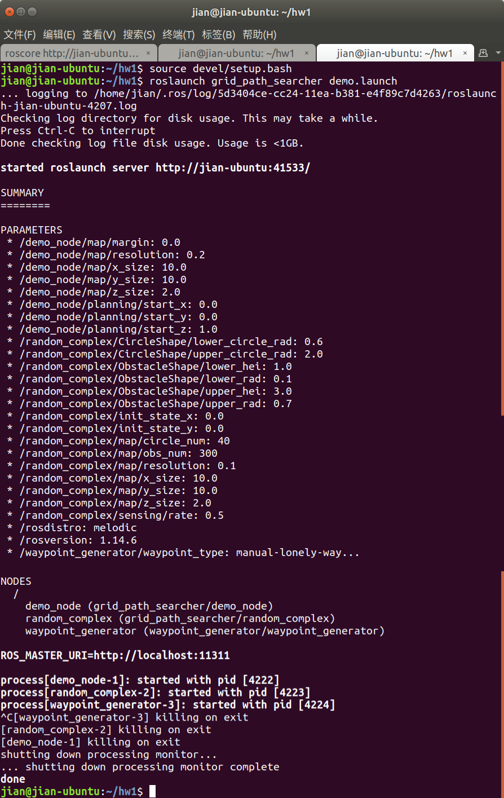

### 作业 1

以下文件位于src/grid_path_searcher/..

<u>CMakeLists.txt：</u> 

```c++
# 加了注释不能直接用
cmake_minimum_required(VERSION 2.8.3)
project(grid_path_searcher)

find_package(catkin REQUIRED COMPONENTS # 依赖的ros包和package（库）
    roscpp 
    std_msgs
    nav_msgs
    visualization_msgs 
)

find_package(Eigen3 REQUIRED)
find_package(PCL REQUIRED)

set(Eigen3_INCLUDE_DIRS ${EIGEN3_INCLUDE_DIR}) # 环境设定（不重要

catkin_package(
  INCLUDE_DIRS include
)

include_directories(  # 依赖的头文件
    include 
    SYSTEM 
    third_party
    ${catkin_INCLUDE_DIRS} 
    ${Eigen3_INCLUDE_DIRS} 
    ${PCL_INCLUDE_DIRS}
)
# 编译选项： C++11？or17？O3：欧三 编译器优化
set(CMAKE_CXX_FLAGS "-std=c++11 ${CMAKE_CXX_FLAGS} -O3 -Wall") # -Wextra -Werror
# 生成的可执行文件：demo_node
add_executable( demo_node 
    src/demo_node.cpp
    src/graph_searcher.cpp)
# 生成的可执行文件：demo_node和连接的库（ros编译好的）
target_link_libraries(demo_node 
    ${catkin_LIBRARIES}
    ${PCL_LIBRARIES} 
)
# 生成的可执行文件：random_complex 
add_executable ( random_complex 
    src/random_complex_generator.cpp )
# 生成的可执行文件：random_complex 和连接的库（ros编译好的）
target_link_libraries( random_complex
    ${catkin_LIBRARIES}
    ${PCL_LIBRARIES} )  

```

<u>package.xml:</u> 注意 编译和运行各需要哪些库：<build_depend>和<run_depend>

#### 常见错误

**roslaunch: [ ] is neither a launch file in package [ ] nor is [ ] a launch file name**

```shell
source /home/catkin_ws/devel/setup.bash
```


之前roslaunch一直不对，以为是16.04和18.04不兼容的问题，其实是没有有写对file name，直接复制粘贴

```shell
rqt_graph
```


/goal：自定义终点在rviz中指定一个就行

椭圆型三个node（节点）

- /waypoint_generator: goal终点信息给/demo_node
- /random_complex: 生成随机复杂地图环境
- /demo_node: subscribe了终点和地图信息，生成两个可视化信息：地图和路径点

#### 代码结构

grid_path_searcher中：

- include：头文件
- launch：启动文件

<u>demo.launch:</u>

可以批次启动多个node

方便修改常用参数（地图大小起始位置）

>   一个node由构成
>
>   <node>
>
>   ...
>
>   </node>

<u>demo_node.cpp</u>

nh.subscribe():[ros::NodeHandle::subscribe() API docs](http://www.ros.org/doc/api/roscpp/html/classros_1_1NodeHandle.html#3b8e4b07d397119cd5c5e4439b170cbc)

#### 运行问题

不能生成path：原因ros rviz_plugins缺3D path planning文件，2D也不行原因：demo.launch里面缺生成路径的代码

-->作业二编写 graphSearch(), getPath()函数

#### commend window




#### 运行结果


