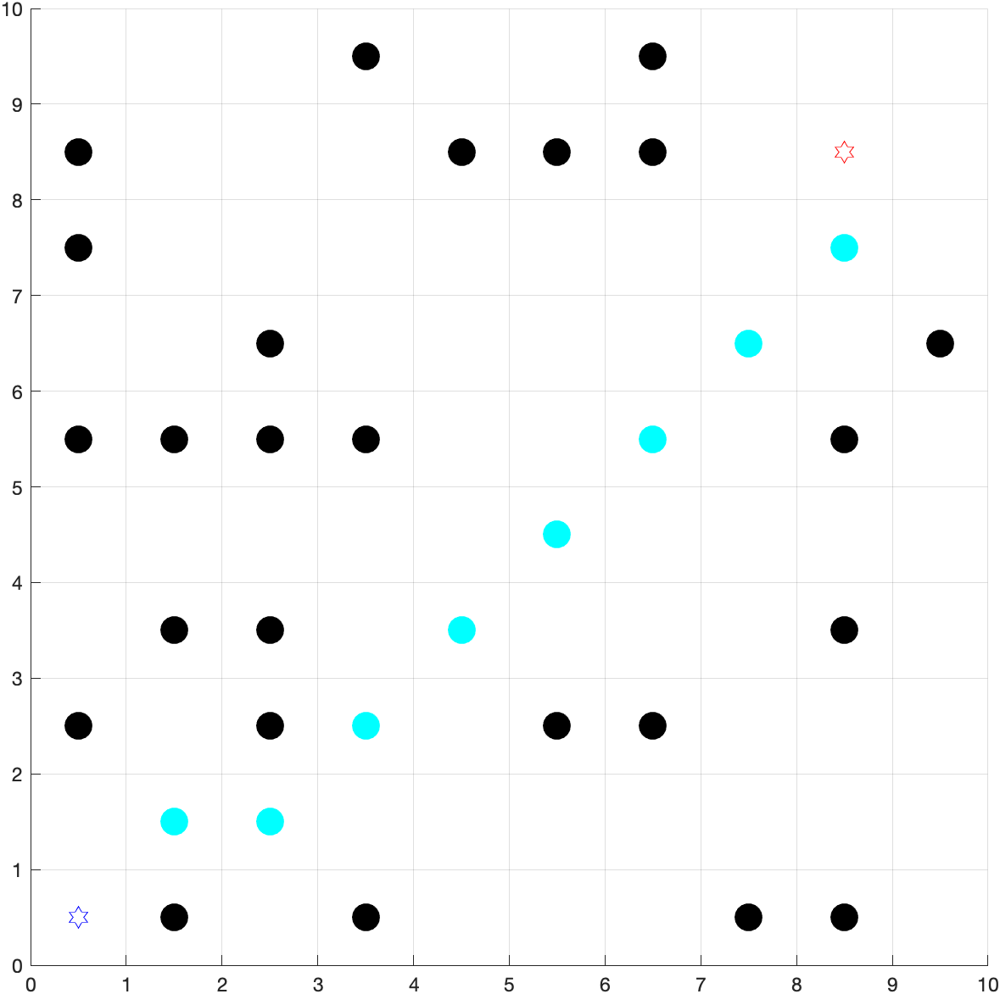
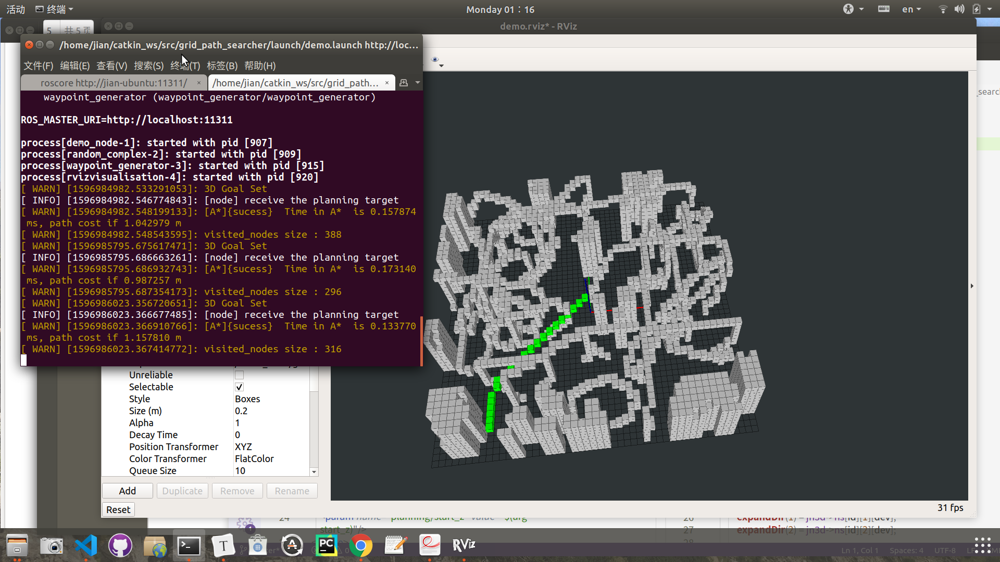
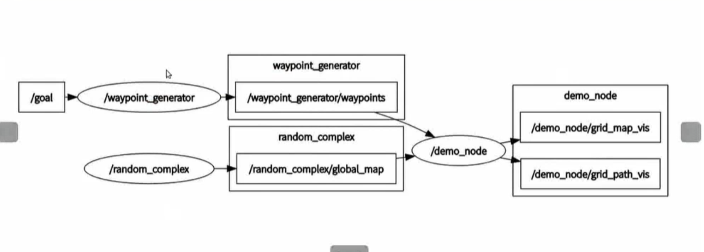

# 作业2

## MATLAB code：

```matlab
size_map = size(map,1); 
%size_map:起点+终点+障碍物的总数
%map:第一个是起点，最后一个是终点，其余是障碍物
```

```matlab
set(gcf, 'Renderer', 'painters'); %渲染器
```

>**The Default Renderer for MATLAB**
>
>By default, MATLAB automatically selects the best rendering method, based on the attributes of the figure (its complexity and the settings of various Handle Graphics properties) and in some cases, the printer driver or file format used.
>
>In general, MATLAB uses
>
>- Painter's for line plots, area plots (bar graphs, histograms, etc.), and simple surface plots
>- Z-buffer when the computer screen is not truecolor or when the `opengl` function was called with `selection_mode` set to `neverselect`
>- OpenGL for complex surface plots using interpolated shading and any figure using lighting



```matlab
function path = A_star_search(map,MAX_X,MAX_Y)
%%
%This part is about map/obstacle/and other settings
    %pre-process the grid map, add offset
    size_map = size(map,1);
    %size_map:起点+终点+障碍物的总数
    %map:第一个是起点，最后一个是终点，其余是障碍物
    Y_offset = 0;
    X_offset = 0;
    
    %Define the 2D grid map array.
    %Obstacle=-1, Target = 0, Start=1
    MAP=2*(ones(MAX_X,MAX_Y));
    
    %Initialize MAP with location of the target
    xval=floor(map(size_map, 1)) + X_offset;
    yval=floor(map(size_map, 2)) + Y_offset;
    xTarget=xval;
    yTarget=yval;
    MAP(xval,yval)=0;
    
    %Initialize MAP with location of the obstacle
    for i = 2: size_map-1 %number of obstacle
        xval=floor(map(i, 1)) + X_offset;
        yval=floor(map(i, 2)) + Y_offset;
        MAP(xval,yval)=-1;
    end 
    
    %Initialize MAP with location of the start point
    xval=floor(map(1, 1)) + X_offset;
    yval=floor(map(1, 2)) + Y_offset;
    xStart=xval;
    yStart=yval;
    MAP(xval,yval)=1;

    %%%%%%%%%%%%%%%%%%%%%%%%%%%%%%%%%%%%%%%%%%%%%%%%%%%%%%%%%%%%%%%%%%%%%%%%%%%%%%%%%%%%%%%%%%%%%%%
    %LISTS USED FOR ALGORITHM
    %%%%%%%%%%%%%%%%%%%%%%%%%%%%%%%%%%%%%%%%%%%%%%%%%%%%%%%%%%%%%%%%%%%%%%%%%%%%%%%%%%%%%%%%%%%%%%%
    %OPEN LIST STRUCTURE
    %--------------------------------------------------------------------------
    %IS ON LIST 1/0 |X val |Y val |Parent X val |Parent Y val |h(n) |g(n)|f(n)|
    %--------------------------------------------------------------------------
    OPEN=[];
    %CLOSED LIST STRUCTURE
    %--------------
    %X val | Y val |
    %--------------
    % CLOSED=zeros(MAX_VAL,2);
    CLOSED=[];

    %Put all obstacles on the Closed list
    k=1;%Dummy counter
    for i=1:MAX_X
        for j=1:MAX_Y
            if(MAP(i,j) == -1)
                CLOSED(k,1)=i;
                CLOSED(k,2)=j;
                k=k+1;
            end
        end
    end
    CLOSED_COUNT=size(CLOSED,1);
    %set the starting node as the first node
    xNode=xval;
    yNode=yval;
    OPEN_COUNT=1;
    hn=distance(xNode,yNode,xTarget,yTarget);
    gn=0;
    fn=hn+gn;
    OPEN(OPEN_COUNT,:)=insert_open(xNode,yNode,xNode,yNode,hn,gn,fn);
    OPEN(OPEN_COUNT,1)=1;% Note: here it is changed
    CLOSED_COUNT=CLOSED_COUNT+1;
    CLOSED(CLOSED_COUNT,1)=xNode;
    CLOSED(CLOSED_COUNT,2)=yNode;
    NoPath=1;
%%
%This part is your homework
%%%%%%%%%%%%%%%%%%%%%%%%%%%%%%%%%%%%%%%%%%%%%%%%%%%%%%%%%%%%%%%%%%%%%%%%%%%%%%%%%%%%%%%%%%%%%
% START ALGORITHM
%%%%%%%%%%%%%%%%%%%%%%%%%%%%%%%%%%%%%%%%%%%%%%%%%%%%%%%%%%%%%%%%%%%%%%%%%%%%%%%%%%%%%%%%%%%%%
    while (NoPath==1 &&(xNode~=xTarget || yNode~=yTarget))
    
%     If the queue is empty, return FALSE; break;
        if (sum(OPEN(:,1))==0) 
            break; 
        end
%     Remove the node “n” with the lowest g(n) from the priority queue 弹出现在path cost最小的node
        i_min = min_fn(OPEN,OPEN_COUNT,xTarget,yTarget);
        xNode_expand = OPEN(i_min,2);
        yNode_expand = OPEN(i_min,3);
        gNode_expand = OPEN(i_min,7);
        OPEN(i_min,1)= 0; %marked as visted
    %      Mark node “n” as expanded 弹出的node存入CLOSED list
        CLOSED_COUNT = CLOSED_COUNT+1;
        CLOSED(CLOSED_COUNT,1)=xNode_expand;
        CLOSED(CLOSED_COUNT,2)=yNode_expand;
    %     If the node “n” is the goal state, return TRUE; break;
        if xNode_expand == xTarget && yNode_expand == yTarget
            NoPath = 0;
            break;
        end
%     For all unexpanded neighbors “m” of node “n”
        exp_array=expand_array(xNode_expand,yNode_expand,gNode_expand,xTarget,yTarget,CLOSED,MAX_X,MAX_Y);
        % expand_array:|X val |Y val |h(n) |g(n)|f(n)|
        if ~isempty(exp_array)
            for m = 1:1:length(exp_array(:,1)) % For all unexpanded neighbors “m” of node “n”
                xNode = exp_array(m,1);
                yNode = exp_array(m,2);
                % If node m is not in OPEN, push node m into OPEN 
                if  isempty(node_index(OPEN,xNode,yNode)) 
                    OPEN_COUNT=OPEN_COUNT + 1;
                    hn=distance(xNode,yNode,xTarget,yTarget);
                    gn=gNode_expand + distance(xNode,yNode,xNode_expand,yNode_expand);
                    fn=hn + gn; 

                    OPEN(OPEN_COUNT,:)=insert_open(xNode,yNode,xNode_expand,yNode_expand,hn,gn,fn);                
                    OPEN(OPEN_COUNT,1)=1;  
                else
                    %If m Node is in OPEN and g(m) > g(n) + Cnm, which means a better path to this node is found
                    %then update parents and g , f value  
                    n_inx = node_index(OPEN, xNode,yNode);
                    if OPEN(n_inx,7) > (gNode_expand + distance(xNode,yNode,xNode_expand,yNode_expand))
                        OPEN(n_inx,4) = xNode_expand;  % Parent X val
                        OPEN(n_inx,5) = yNode_expand;  % Parent Y val
                        OPEN(n_inx,7) = gNode_expand + distance(xNode,yNode,xNode_expand,yNode_expand);  % g(m)
                        OPEN(n_inx,8) = OPEN(n_inx,6) + OPEN(n_inx,7);  % f(m)
                    end 

                end
                                    
            end
        end    
   
    
    end % End of While
    
    
    path=[];
    count=1;
    last_x=xTarget; %存入终点
    last_y=yTarget;
    %从终点开始，寻找当前节点的parent node，直到找到起点，形成path
    while(last_x ~= xStart || last_y ~= yStart)
        path(count,:)=[last_x,last_y];  %将当前点存入path中
        count=count+1;
        current_index=node_index(OPEN,last_x,last_y);
        last_x=OPEN(current_index,4);%找到当前节点的parent坐标
        last_y=OPEN(current_index,5);
    end
    path(count,:)=[xStart, yStart];
    

    
   
    
end
```


#### MATLAB 指令

- index从1开始，“:” 中不去头不去尾

  ```matlab
  i= 2:3
  ```

  i = [2, 3]

- OPEN LIST STRUCTURE

  |1/0 |X val |Y val |Parent X val |Parent Y val |h(n) |g(n)|f(n)|

  1:没查， 0:已查

- tap键works

- loop没有冒号，条件在（）中

- command + T：取消comment  

  command + /： comment  

- 

  ```matlab
  set(gcf,'position',[x0,y0,width,height])
  ```

  By default, the position is in pixels.

## 

## ROS code

#### .launch file

```
<arg name="map_size_x" default="10.0"/>
<arg name="map_size_y" default="10.0"/>
<arg name="map_size_z" default=" 1.0"/>
```

生成obstacle map：第一层0，共5层（0-4）表示1m

```
<arg name="map_size_x" default="10.0"/>
<arg name="map_size_y" default="10.0"/>
<arg name="map_size_z" default=" 2.0"/>
```

生成obstacle map：第一层0，共10层（0-9）表示2m

```
rosparam get /[tap]
```

查看parameter

```
---roslaunch/XML/node attributes---
在：  <node pkg="grid_path_searcher" type="demo_node" name="demo_node" output="screen" required = "true">中
required = "true"
```

If node dies, kill entire roslaunch 

#### commend line 

```shell
roscore      //第一个commend window

source devel/setup.bash      //第二个commend window

 roslaunch grid_path_searcher demo.launch
```



#### 颜色：

左侧选项选择background，obstacle颜色，path颜色coding path还是不能改变

#### 固定地图

#### heuristic function：

##### Diagonal：

>diag = min{dx, dy, dz}
>
>​    if(diag == dx)
>
>​      h = **sqrt**(3.0)*diag+**sqrt**(2.0)***min**((dy-diag),(dz-diag))+**abs**(dy-diag)
>
>​    if(diag == dy)
>
>​      h = **sqrt**(3.0)*diag+**sqrt**(2.0)***min**((dx-diag),(dz-diag))+**abs**(dz-diag)
>
>​    if(diag == dz)
>
>​      h = **sqrt**(3.0)*diag+**sqrt**(2.0)***min**((dx-diag),(dy-diag))+**abs**(dx-diag)

##### Manhattan:

> ​    dx = abs(node.x - goal.x)
>
> ​    dy = abs(node.y - goal.y)
>
> ​	dz = abs(node.z - goal.z)
>
> ​     return D \* (dx + dy + dz)

##### Euclidean:

> dx = abs(node.x - goal.x)
>
>​    dy = abs(node.y - goal.y)
>
>​	dz = abs(node.z - goal.z)
>
>**sqrt**(dx * dx + dy * dy + dz * dz)

为什么会出现Manhattan启发函数效率最高的情形，甚至比Diagonal还要快：

启发式函数最优性条件：h(t) <h*(t),使用Manhattan不满足以上条件。在牺牲最优性的前提下Manhattan会扩展更少的点，带来更快的效率，但不具备最优性，所以不采用其作为启发式函数


## 第二节

###### A*


###### greedy


`rqt_graph`

